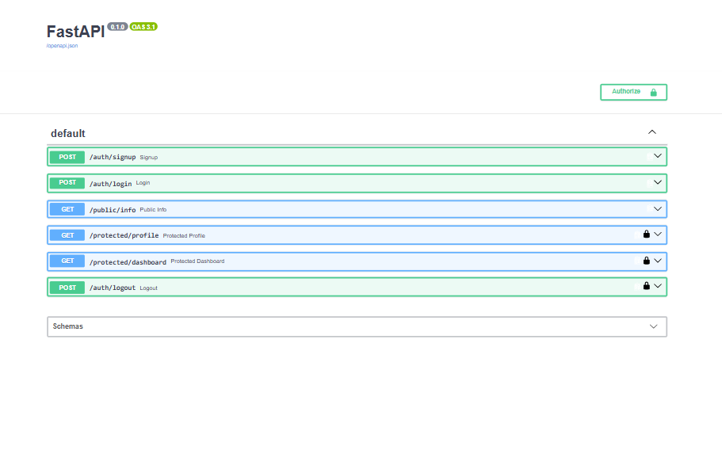

# Auth Practice API — FlyRank Backend AI Engineering Assignment 4

A secure authentication API built with FastAPI and Supabase Auth, using JSON Web Tokens (JWTs)
to protect specific routes. Built as part of the FlyRank AI Backend AI Engineering internship.

**Author:** Noor Fatima
**Repo:** https://github.com/Noor-FatimaDev/flyrank-auth-practice

## What this project does

This API demonstrates a secure signup → login → protected-access flow using Supabase as the
Identity Provider (IdP). The backend never stores passwords or user credentials directly —
Supabase handles credential storage and JWT issuance, and this API verifies tokens with Supabase
on every request to a protected route rather than storing sessions itself.

- Public routes: open to anyone, no token required
- Protected routes: require a valid `Authorization: Bearer <token>` header, verified live against Supabase on every request

## Setup

1. Clone the repository:
   ```
   git clone https://github.com/Noor-FatimaDev/flyrank-auth-practice.git
   cd flyrank-auth-practice
   ```

2. Create and activate a virtual environment:
   ```
   python -m venv venv
   venv\Scripts\activate
   ```
   *(Mac/Linux: `source venv/bin/activate`)*

3. Install dependencies:
   ```
   pip install -r requirements.txt
   ```

4. Create a `.env` file in the project root with your own Supabase project credentials:
   ```
   SUPABASE_URL=your_project_url
   SUPABASE_KEY=your_anon_key
   PORT=3000
   ```
   You can find your Project URL and anon/public key under **Project Settings → API Keys**
   (legacy anon key tab) in your own Supabase dashboard.

   **Important:** In your Supabase project, go to **Authentication → Sign In / Providers → Email**
   and turn **off** "Confirm email" — this avoids hitting Supabase's email rate limit during
   testing, since this project doesn't implement email confirmation flows.

## Running it

```
uvicorn main:app --reload --port 3000
```

Once running, open `http://localhost:3000/docs` to view the interactive Swagger UI.

## API Reference

| Endpoint | Method | Auth Required | Description |
|---|---|---|---|
| `/auth/signup` | POST | No | Create a new account. Returns `201` with user data, or `400` if email/password missing. |
| `/auth/login` | POST | No | Log in with email/password. Returns `200` with `access_token` and `refresh_token`, or `401` if credentials invalid/missing. |
| `/auth/logout` | POST | **Yes** | Logs out the current session. Returns `204 No Content`. |
| `/public/info` | GET | No | Returns a public welcome message. Always `200`. |
| `/protected/profile` | GET | **Yes** | Returns the authenticated user's `id`, `email`, and `created_at`. Returns `401` if token missing/invalid/expired. |
| `/protected/dashboard` | GET | **Yes** | Example second protected route, demonstrating the reusable auth dependency. |

## Authentication flow

1. Client calls `/auth/signup` or `/auth/login` — Supabase issues a JWT (`access_token`).
2. Client stores the token and sends it on protected requests as:
   ```
   Authorization: Bearer <access_token>
   ```
3. The server's `get_current_user` dependency extracts the token and calls
   `supabase.auth.get_user(token)`, which verifies the token's signature and expiry directly
   with Supabase.
4. If valid, the route runs normally. If invalid/expired, the server returns `401` before the
   route's own logic ever executes.

## Swagger UI

Protected routes are marked with a lock icon 🔒, and the "Authorize" button lets you test them
directly from the browser using a Bearer token.



## Tech stack

- **FastAPI** — Python web framework
- **Supabase Auth** — Identity Provider (signup, login, JWT issuance)
- **python-dotenv** — environment variable management
- **Uvicorn** — ASGI server